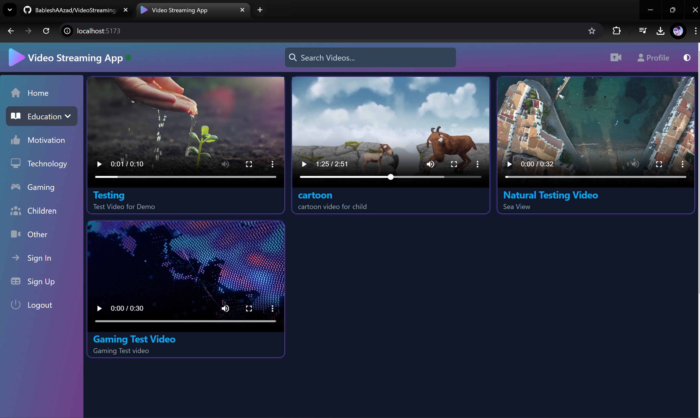

## 💻📽️ Video Streaming Web Application - UI 📺📸

This project is a video streaming application, similar to YouTube or an e-learning platform. It implements the core principles of video streaming, such as delivering data in chunks based on internet quality.
The backend API is designed specifically for handling video streaming functionalities.
for backend documentation : [Video Streaming Web App - API](https://github.com/BableshAAzad/VideoStreamingApp-API)

---

**🏠 Features:**
- Upload videos.
- Watch videos streamed in `.m3u8` format, which automatically adjusts video quality based on connection speed.
- Use of `.m3u8` files helps prevent data theft by avoiding video downloads.
- Search and sort videos based on your interests.
- Infinite Scroll
---

**🧑‍💻 Technologies Used:**

`ReactJS + Vite` `JavaScript` `HTML` `CSS` `Tailwing CSS` `React + FlowBite` `react-infinite-scroll-component` `react-top-loading-bar` `react-player` `react-helmet-async` `react-router-dom`

---

**💻 How to Use the Source Code:**
1. Download the `main` branch as a zip file.
2. Import the project into your IDE and ensure Node.js is installed.
3. In the root directory, open a command prompt and run: `npm install`.
4. <u>Run the Video Streaming Web Application API in parallel.</u>
---

#### 📝 Project UI Examples 🔍

>- 🔍📺📽️ Home Page
<p align="center">
  
</p>

>- 📸📹 Video upload Page
<p align="center">
  
</p>

**Response:**
  ```json
  {
  "status": 200,
  "message": "Videos are founded",
  "data": {
    "links": [],
    "content": [
      {
        "videoId": "06c6dc6b-d63e-40f5-95dc-310b8ba0f3cb",
        "title": "Nature",
        "description": "Nature demo video",
        "contentType": "video/mp4",
        "filePath": "videos\\video-1.mp4"
      },
      {
        "videoId": "078705d4-fdea-42f1-ac0f-6557037adf07",
        "title": "Cartoon Dyno",
        "description": "Cartoon demo video",
        "contentType": "video/mp4",
        "filePath": "videos\\video-2.mp4"
      },
      {
        "videoId": "0cbd6040-0e4e-47b6-9f66-86f8c9554835",
        "title": "Mountain Views",
        "description": "Test video here shown view of mountains",
        "contentType": "video/mp4",
        "filePath": "videos\\video-3.mp4"
      }
    ],
    "page": {
      "size": 5,
      "totalElements": 3,
      "totalPages": 1,
      "number": 0
    }
  }
}
  ```
---
